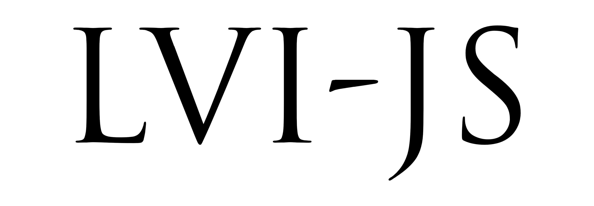

# LVI-JS

A js-library that empower you website by adding a LVI font style in memory of LVI 🇮🇹 Italian Prime Minister B.M.

_parody._

### How to use

Insert this tag on your website:

```html
<script src="https://lvi-js.pavone.dev/lvi.js"></script>
```

Enjoy the new font im memory of LVI!

#### Disclaimer
> This is a parody repo used to remember how dark was the Italy government on the '90s a bit like now days' government, after latest political elections   
